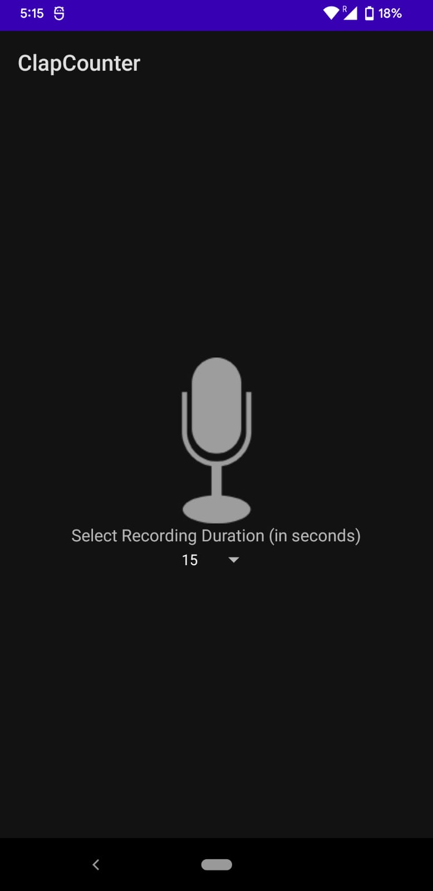
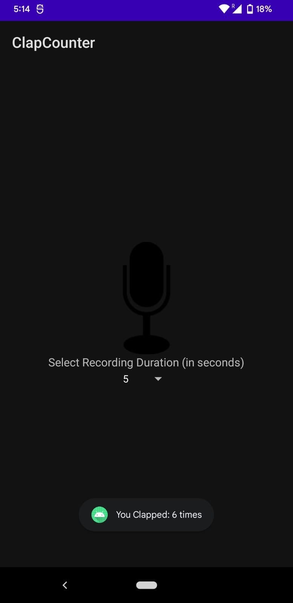
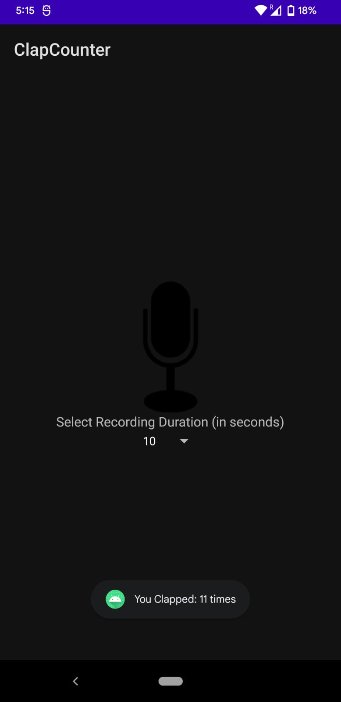
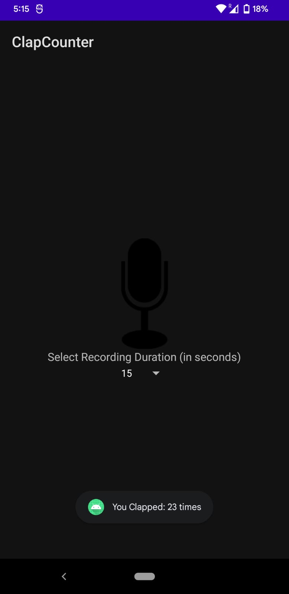

### cmpe277_clapapp
### Course: Smartphone Application Development

### Learning Objective:
using Proximity (TYPE_PROXIMITY) sensor, develop mobile clap app. The goal is to simulate clapping using mobile phone and hand.

### Clap counter ON.

### Clap Counter OFF and clap count 5seconds.

### Clap Counter OFF and clap count 10seconds.

### Clap CounterOFF and clap count 15seconds.

